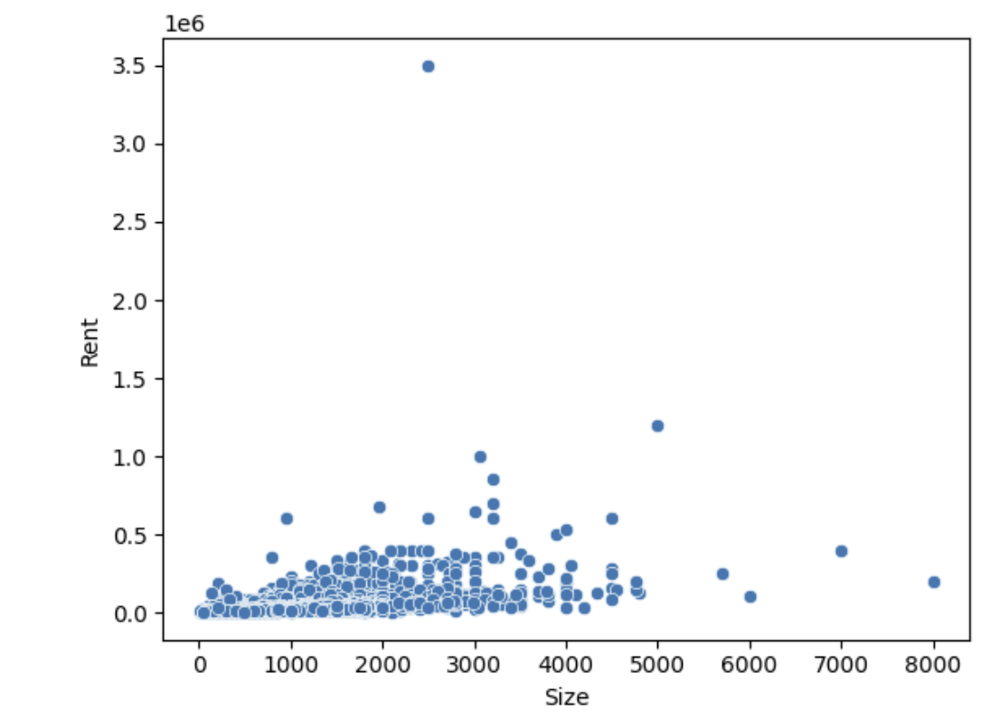
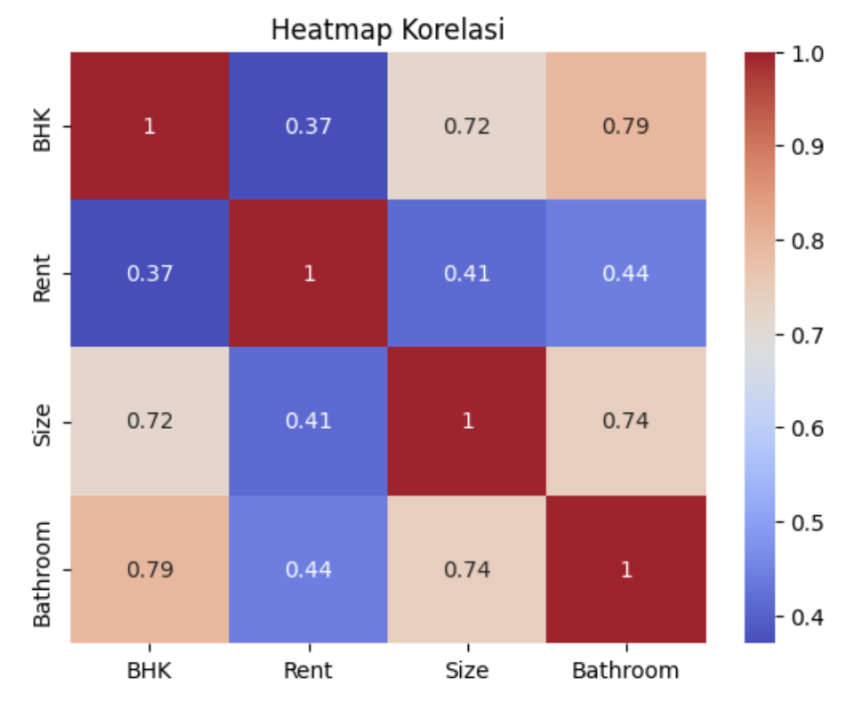
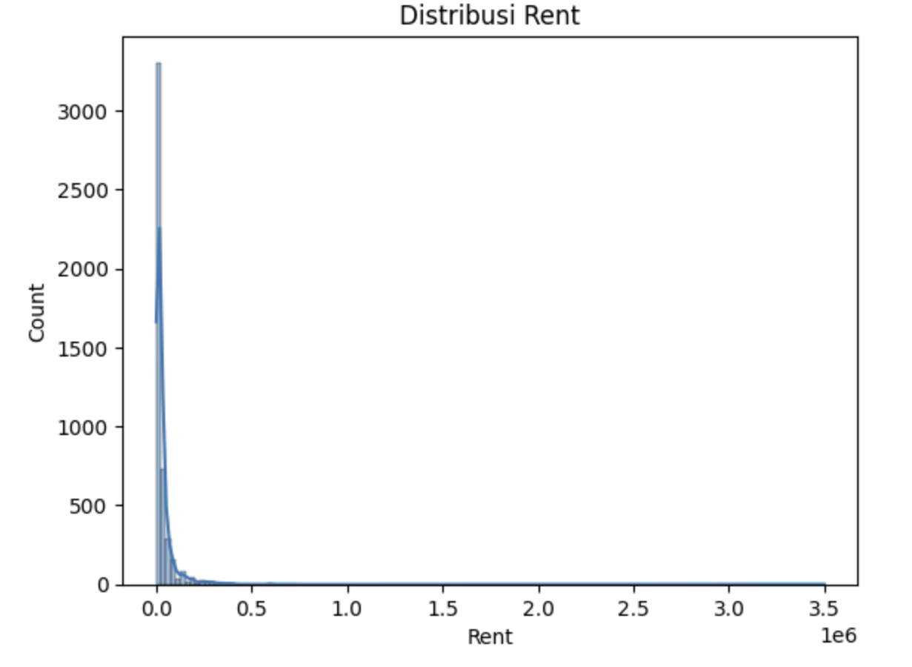

# 📊 Analisis Harga Sewa Properti

## Deskripsi
Analisis ini bertujuan untuk mengidentifikasi faktor-faktor yang mempengaruhi harga sewa properti berdasarkan berbagai karakteristik utama, seperti luas properti, jumlah kamar tidur, jumlah kamar mandi, serta fasilitas yang tersedia. Pendekatan yang digunakan adalah exploratory data analysis (EDA) untuk memahami pola distribusi harga dan hubungan antar variabel. Melalui analisis ini, diharapkan dapat diperoleh insight yang membantu dalam memahami bagaimana setiap karakteristik berkontribusi terhadap penentuan harga sewa, serta memberikan dasar dalam pengambilan keputusan yang lebih tepat terkait strategi penetapan harga properti.

## Tujuan
1. Mengidentifikasi faktor utama harga sewa
2. Menganalisis pola distribusi data
3. Memberikan rekomendasi berbasis data
  
## 📊 Visualisasi

### 1. Hubungan Size dan Rent

### 2. Korelasi Antar Variabel

### 3. Distribusi Harga Sewa

## 💡 Insight Utama
- Luas properti memiliki pengaruh paling besar terhadap harga sewa
- Harga tidak merata karena adanya outlier
- Properti besar cenderung memiliki harga tinggi
  
## 🧠 Rekomendasi
- Gunakan luas sebagai dasar penentuan harga
- Terapkan segmentasi properti
- Optimalkan strategi pricing untuk properti premium
